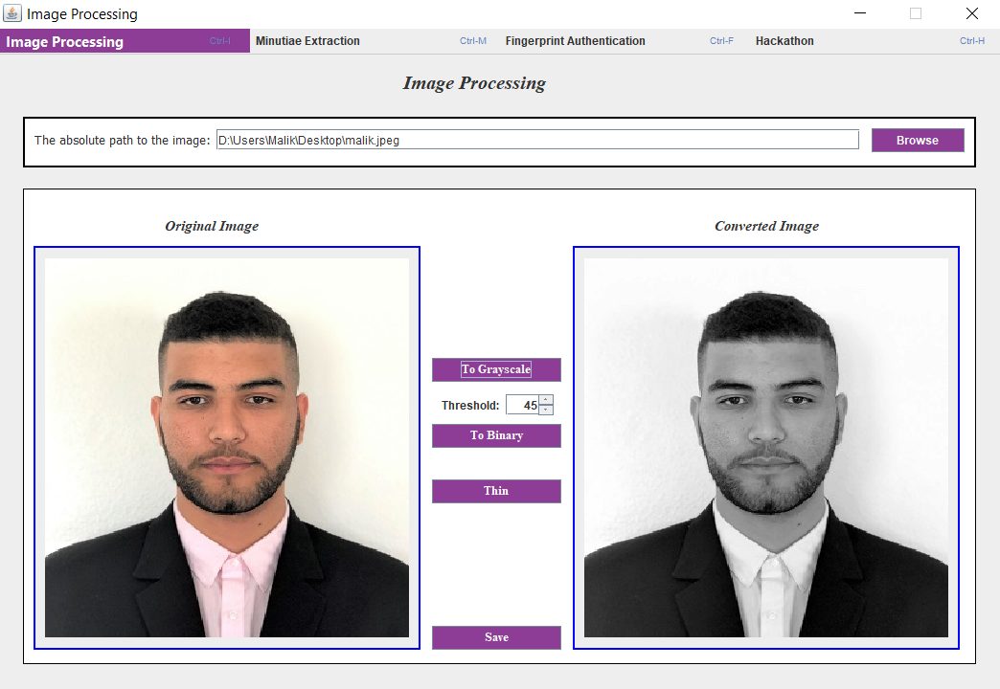
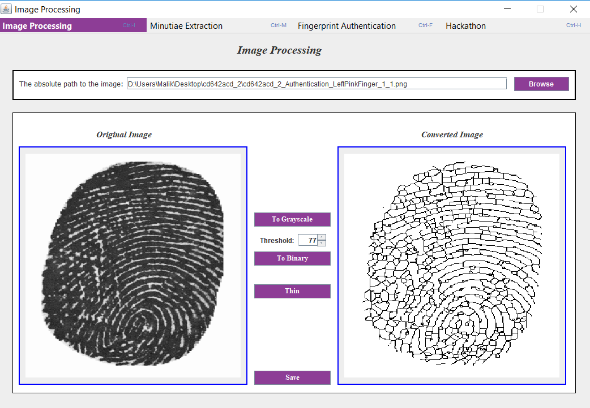
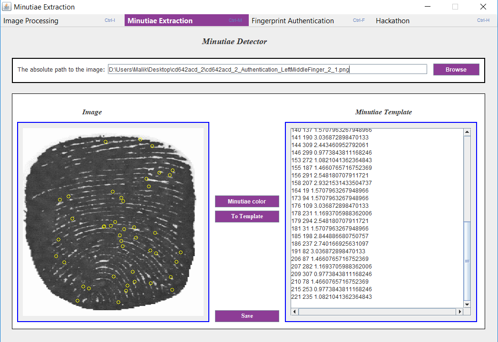
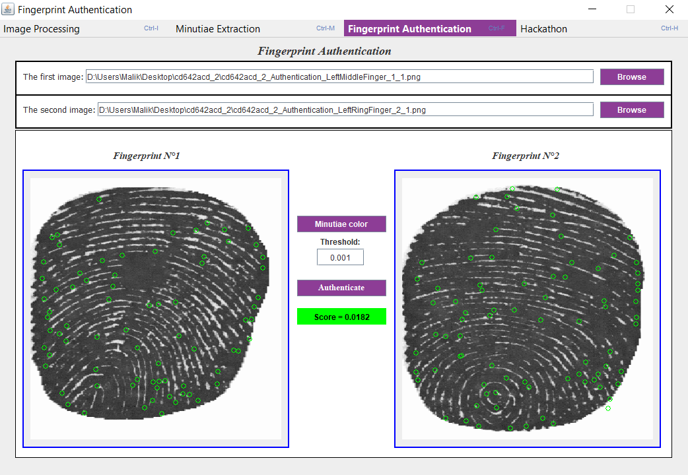

# Fingerprint-Analysis
Image Processing - Minutiae Extraction - Fingerprints Authentication

# Utilities

- <a href="http://biolab.csr.unibo.it/research.asp?organize=Activities&select=&selObj=82&pathSubj=111%7C%7C8%7C%7C82&Req=&#" target="_blank">MCC SDK</a>
- <a href="https://ws680.nist.gov/publication/get_pdf.cfm?pub_id=51097" target="_blank">Mindtct</a>
- Evaluation (Copyright owned by Alexandre Ninassi)

# Repository Owner

This repository is owned by Abdelmalik GHOUBIR

# License

This project is under MIT License

# IDE

# Demo

